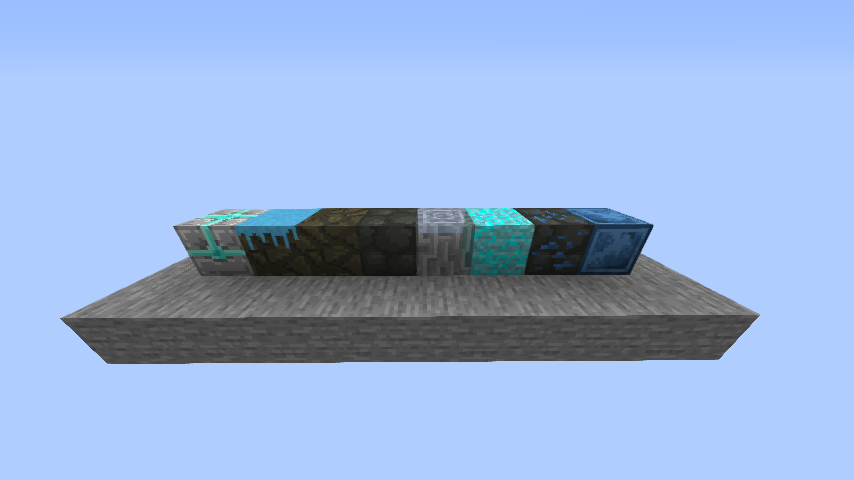

SQRD Mod is a minecraft mod I devloped for a private mincraft server and was a early and big step of my programming journey, I learned to take apart source code and that there isn't tutorials for everything. The members of the server, including me, threw some ideas together, taking in the fact a couple of friends streaming gameplay of the server. My first attempt of this project was made with the [Forge Mod Loader](https://files.minecraftforge.net/net/minecraftforge/forge/) due to my lack of programming skills at the time, I stopped completely.

